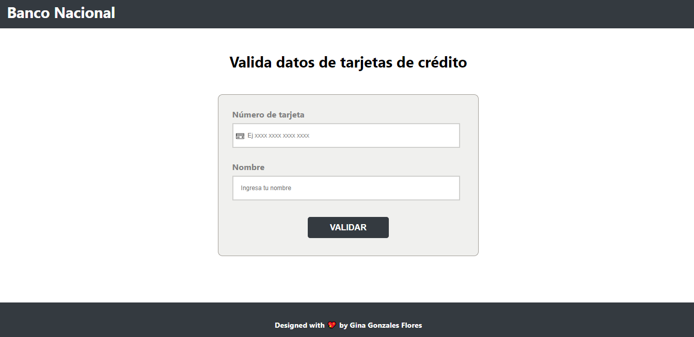
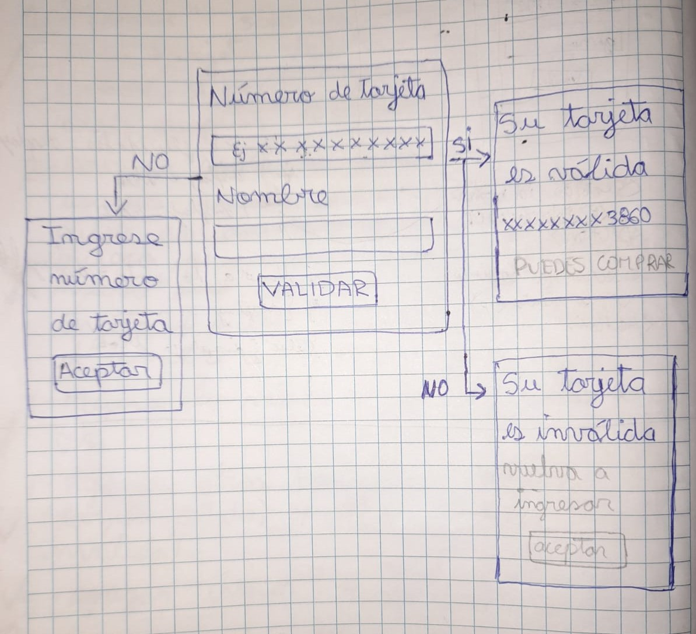

# BANCO NACIONAL

## Índice

* [1. Resumen del proyecto](#1-resumen-del-proyecto)
* [2. Investigación UX](#2-investigación-ux)
* [3. Prototipo](#3-prototipo)
* [4. Feedback recibido](#4-feedback-recibido)
* [5. Plan de acción](#5-plan-de-acción)

***

## 1. Resumen del proyecto

Este proyecto es el desarrollo de una aplicación web donde el usuario debe de ingresar su número de tarjeta de crédito y su nombre para qué le permita saber si es una tarjeta válida o inválida. Y pueda realizar un pago o transferencia a través de la misma banca por internet (Banco Nacional).

## 2. Investigación UX

### Proceso del diseño

#### Usuario:

  - Esta aplicación web son solo para los usuarios que tengan una cuenta de crédito o tarjeta de crédito y puedan validar.

#### Definir la problemática del usuario:

  - En todo caso que el usuario ponga un número de tarjeta incorrecto, su número de tarjeta será inválida y no podrá realizar ningún pago o transferencia.
  - Para que el usuario realice un pago o transferencia debe de validar primero su tarjeta, si es válida podrá hacer cualquier servicio que desee, pero si no es válida tendrá que volver a ingresar su número de tarjeta.

#### Requerimientos funcionales:
  - Vista amigable.
  - Preguntar por el número de tarjeta y nombre.
  - Mostrar mensaje si la tarjeta ingresada es válida o inválida.
  - Botón con distintas rutas.

## 3. Prototipo

## 4. Feedback Recibido

- No utilizar var.
- Declarar con nombres claros para yo pueda entender (let y const).
- Búsqueda de arreglos y métodos.
- Búsqueda de información sobre condiciones y bucles para poder realizar el algoritmo de luhn.
- Búsqueda de información sobre enmascarar en JavaScript (mostrar solo los últimos 4 dígitos del número de tarjeta).
- Búsqueda de información sobre módulo en JavaScript.
- Entender mi código y lo que trato de hacer en ello.

## 5. Plan de Acción

* Validar que solo ingrese números y que no se pueda escribir en el input letras u otros tipos de caracteres.
* Obtener los datos del input.
* Agregar los números de la tarjeta a un array en orden inverso.
* A todos los números de las posiciones pares  se deberá de multiplicar por dos y si el doble de ese número es mayor o igual a 10 debemos de sumar los dígitos del resultado.
* Luego sumar los dígitos de las posiciones impares y el número que se obtendrá de las posiciones pares.
* El resultado, deberás obtener el residuo de la división entre 10 y si es igual a 0 la tarjeta de crédito será válida. 
* Mostrar solo los 4 últimos números de la tarjeta del usuario.
* Mejorar lo visual CSS.
* Ocultar los campos cuando de clic en el botón de validar y mostrar si la tarjeta es válida o inválida.
* Permitir que los dígitos sean mayor a 12 y menor a 19 dígitos.
* Arreglar para que complete todos los inputs o si no, no podrá validar.
* Arreglar cuando muestre el mensaje del alert y al dar clic permita limpiar los datos del input.
* Cuando muestre válida o inválida se debe de mostrar un botón y al dar clic regresara a la página principal.
